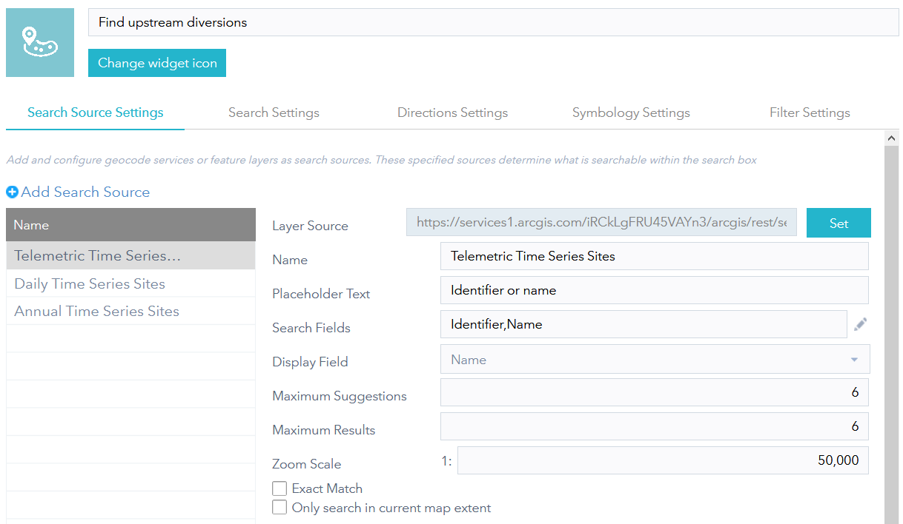
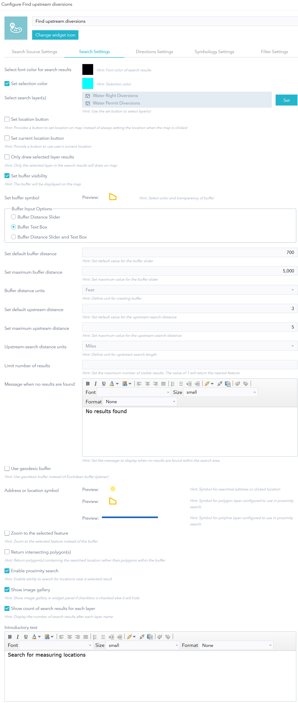
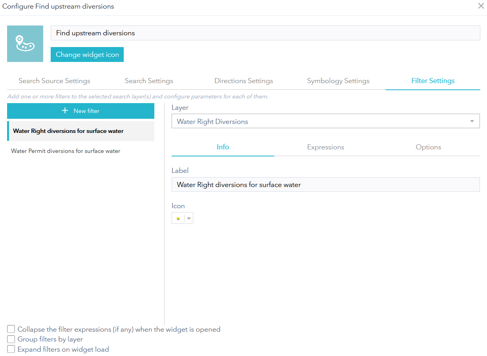
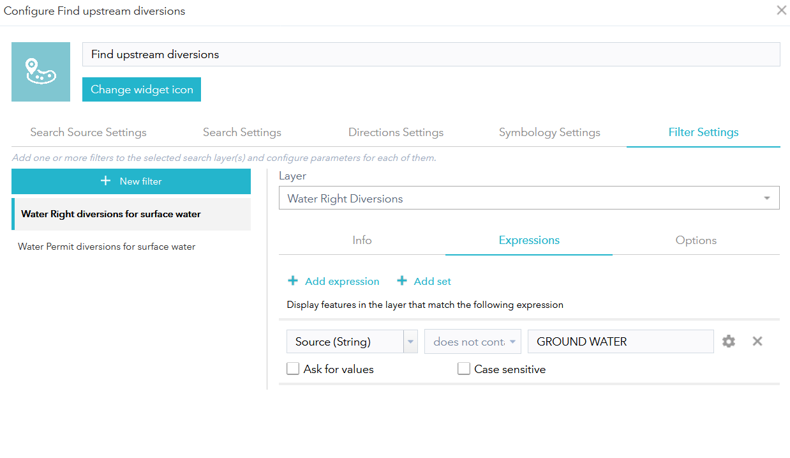

# upstream-tracer
## Configure the EpaTracer Widget within Web AppBuilder   
Add the `EpaTracer` widget to the web application. Optionally change the title or widget icon. 
Set one or more search-sources, one or more search layers and the parameters that govern the upstream trace.
Refer to the introduction in [README.md](README.md) for an example of a configured widget.   

This widget is derived from [Esri's NearMe](https://doc.arcgis.com/en/web-appbuilder/create-apps/widget-near-me.htm) widget.
Even though the labels for this widget's user interface have been modified,
the configuration instructions on that page can be used to supplement this page.
## Search Source Settings
Specify the layers used to select a starting point for the upstream-trace.   
> 
## Search Settings
Specify the layer(s) to search for -- each search-layer must have a pop-up configured.  
Buffer distance (width) and upstream distance are set here.  
> 
## Directions Settings
This sets the direction of the trace, upstream or downstream.  
##### This setting is not currently used in this widget.   
## Symbology Settings
Use graphics to represent attribute values
##### This setting is not currently used in this widget.   
## Filter Settings
Set filters on search-layers. Specify the label.   
>    

For example, choose to see only results where values of the "Source" field do not contain "GROUNDWATER".   
> 