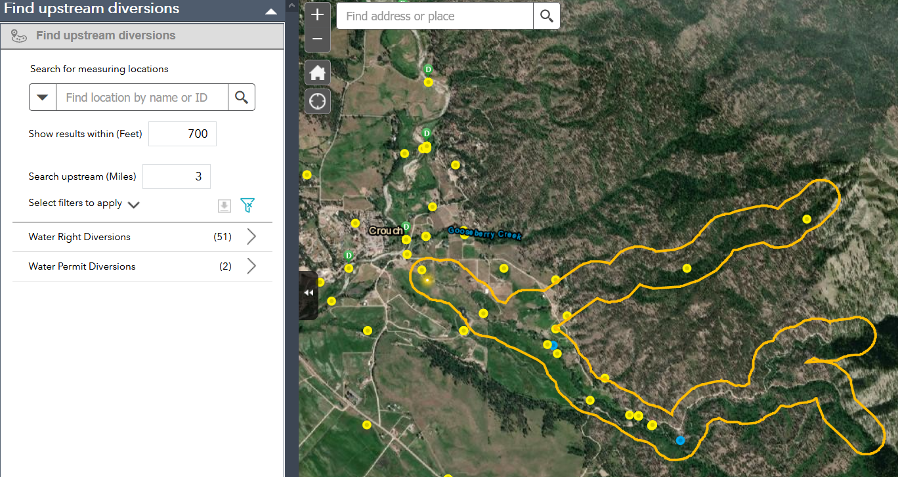

# upstream-tracer
 Trace NHDPlus flow-lines, upstream from a location, buffer and select features.
## EpaTracer Web AppBuilder Widget
This widget allows users to find features near NHDPlus flowlines. It utilizes the EPA's WATERS Upstream/Downstream Search Service; it is a derivative of Esri's _Web AppBuilder_ `Near Me` widget.
This widget is intended for use in web applications built using the _Web AppBuilder for ArcGIS_. It includes a configuration user interface that allows developers to modify the tracer's input parameters.

## Introduction
The map in this example shows a buffer outlining the portion of the NHDPlus stream network that was traced upstream, 
for three miles, from the user's point-of-interest.

The results returned from querying the `EpaTracer` for all water rights/permits 
diversions within 700 feet of traced streams are shown in the widget's user interface.

#### Configuration
The labels and values for the widget's user interface are configurable.  The developer can change the following:
* Widget title, labelled as _Find upstream diversions_
* Layers used to find a starting point for the upstream-trace, labelled as _Search for measuring locations_ 
* Buffer distance and units.
* Distance (and units) to search upstream -- this is the length of the upstream trace.
* Feature layers to query using the buffer. 
* Filter(s) to be applied when searching for features.

## Sections

* [Features](#features)
* [Requirements](#requirements)
* [Instructions](#instructions)
* [Issues](#issues)
* [Licensing](#licensing)

## Features
By: Ben Britton   
    State of Idaho, Department of Water Resources

Trace NHD flowlines, apply a buffer to those flowlines and find features near those streams.

#### Processing Steps
* Find the NHDPlus flowline nearest the user-selected point
* Trace flowline(s) upstream for a user-specified distance and return the results to this widget
* Buffer the resultant flowlines by a user-supplied margin
* Use that buffer to select features from developer-configured feature-layers
* Display those features on the map
* Display the total number of features found for each layer as well as the attributes of those features in a table within the widget's panel
* Allow users to download the attributes of the found features.

All JavaScript functions in the base widget's source-code, named like ___epa*___, are derived from the [WATERS_SUPPORT Codepen](https://codepen.io/WATERS_SUPPORT/pen/jEKaEx), supplied by the EPA.

__WATERS__ is the EPA’s [Watershed Assessment, Tracking & Environmental Results System](https://www.epa.gov/waterdata/waters-watershed-assessment-tracking-environmental-results-system).

## Requirements
* Requires Web AppBuilder for ArcGIS version 2.16 (minimum).
* Network access to [EPA's WATERS web services](https://www.epa.gov/waterdata/waters-web-services).

## Instructions
__Deploying this widget:__

Create a folder named `EpaTracer` in the stemapp/widgets directory, which is located in %webappbuilder_install%/client. Copy this widget's contents to that folder.

For more resources on developing or modifying widgets visit
[Web AppBuilder for ArcGIS Documentation](http://doc.arcgis.com/en/web-appbuilder/).

## Issues

* Find a bug or want to request a new feature?  Please let us know by submitting an issue.

## Licensing

Copyright 2020 State of Idaho, Department of Water Resources

Licensed under the Apache License, Version 2.0 (the "License");
you may not use this file except in compliance with the License.
You may obtain a copy of the License at

   http://www.apache.org/licenses/LICENSE-2.0

Unless required by applicable law or agreed to in writing, software
distributed under the License is distributed on an "AS IS" BASIS,
WITHOUT WARRANTIES OR CONDITIONS OF ANY KIND, either express or implied.
See the License for the specific language governing permissions and
limitations under the License.

A copy of the license is available in the repository's
[LICENSE.txt](./LICENSE) file.

**Tags:** stream tracer   
**Language:** Javascript
